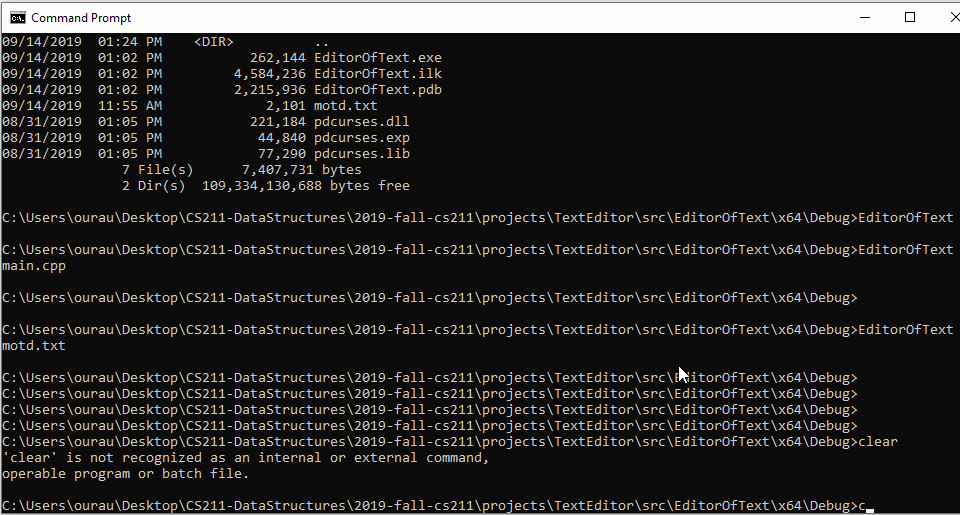

# Design Diary
Use this space to talk about your process.  For inspiration, see [my prompts](../../../docs/sample_reflection.md) 

I need to investigate how to open a file to read and display it's contents in the text editor. Issue #9 will track
the progress of this https://github.com/itravers/2019-fall-cs211/issues/9
It looks like all I needed to do was read a file in line by line into a string vector
Then I loop through the vector printing line by line to the screen.

I need to investigate how to open a file from the command line, and how to debug with curses.
https://github.com/itravers/2019-fall-cs211/issues/16
In visual studio, right click on the project file, not the solution file.
Go to Debugging and under command arguments list your command arguments just as you would from the command line.
I can't just concatanate a char* to a string, I need to figure out how to do that.

I can now trigger the menus's with mouse clicks. I had to create a mouse handler function
that calls the MenuController and has it tell us if this click involves a menu or not.
If this click does involve a menu, we tell the MenuController to processes the click, 
which at this point only opens or closes a menu. Closed github issue:
https://github.com/itravers/2019-fall-cs211/issues/7

Getting the text to scroll vertically when the cursor is moved was interesting.
First I needed to actually make a variable that tracks cursor location.
I had to make sure my displayContents functions actually call displayCursor()
so you can see the cursor. Then I wired up the arrow keys to move the cursor.
If the cursor gets moved off of the bottom of the screen, it actually stays
the same place, but the lines get printed starting at the second line instead of 
the first. Then I needed a variable to track the startLine, so we know where
in the lines vector to start printing. We make sure not to increase startLine so
it is never larger than the size of the lines vector. Then I had to worry about
startLine becoming negative, or the cursor being in a negative area, so we 
added checks to make sure that didn't happen. Now if the cursor try's to
go up off the top of the screen it will scroll the screen up.
https://github.com/itravers/2019-fall-cs211/issues/17

Word wrap is now working satisfactorily. We now properly word wrap. We take
care of any instance of tabs in the text before the word wrapping. We are also
showing a special character at the end of all the columns to let the user
know when a line has been word wrapped. There is a special 1 column window
now being displayed whose only purpose is to display a character to the user
on any line a word wrap takes place. Later on we'll be able to make a setting
that will be able to turn this window's visibility off.
https://github.com/itravers/2019-fall-cs211/issues/22

Here is a GIF of the text editor working at this point:
