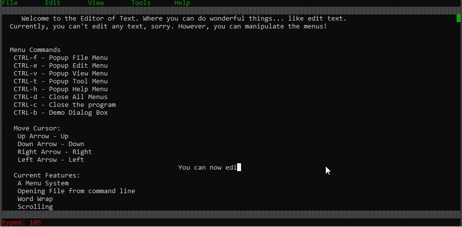

# Design Diary

Use this space to talk about your process.  For inspiration, see [my prompts](../../../docs/sample_reflection.md) 

I started this milestone by trying to get my keyboard input to output to the screen.
We are rendering the screen in the loop, so if we edit currentLines in ContentController
Then that edit should automatically show up on the screen.
So now we just have to figure out how to edit the file.
I am trying to just replace characters in the vector. The trick is getting these
characters to replace at exactly the right point, there is a disconnect between cursorLocation.x
and the actual location that the character is in in the vector.

I'm considering turning the text editor into a manager that manager
submanagers. these submanagers would talk to the manager via the
service locator pattern. I didn't feel the observer pattern gave
a submanager proper access to other submanagers while still
staying decoupled enough to be resistant to change. The service
locator pattern, as I understand it, will allow 

https://stackify.com/service-locator-pattern/

I've done former work using the service locator pattern here:
https://github.com/itravers/ARaceInSpace/tree/master/core/src/com/araceinspace/EventSubSystem

This is an event subsystem I designed to decouple parts of 
a game I hobbled together in my spare time. I think
I will take this general idea and apply it to my text editor
making the main manager talk to all the submanagers using
a similar event subsystem. Later on I can actually incorporate
that event subsystem into my curses wrappers.

(This idea is in the branch newhead)
I'll be working on it in the background, seeing if I can decouple 
my current objects further with it.

So currently editing text shown works. We are not inserting, but replacing,
perhaps insert would be a good option to have later.

I'm still using a vector of a line of strings, when I want to replace a certain
character, I go to that line in the vector of lines. If the line I want to edit is beyond
the limit of the vector, than I need to enter empty lines in the vector, and then
insert the text I want. Similarily if the line that I want to edit is not long enough,
I have to enter blank spaces until we have enough characters to come to the character I
am wanting to edit. It works though, so there is that...

The screen is refreshed with the contents of this vector whenever a change is made.
In order to make the scrolling persist, we keep track of where we are scrolled
to and we only start displaying the vector from that line. Pretty simple.

Here is a GIF of the text editor working at this point:

