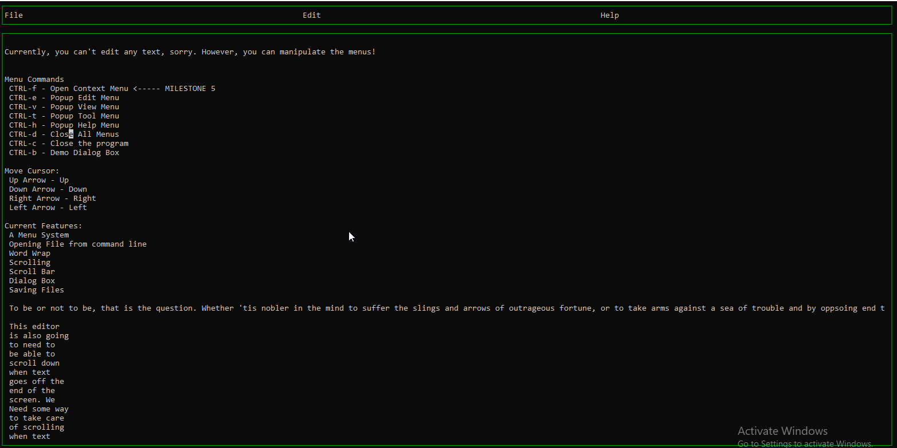

# Design Diary

Hit CTRL-F to get the context menu to show.

In this milestone I Learned to use a Trie to create a context menu, among other things.

I decided to partition this milestone into several sub-sections as follows:
1. Make A Menu System that Will work for my Context Menu.
2. Figure out the Trie, Get it working correctly.
3. Create a function that will be able to tell what word my cursor is currently on in the buffer.
4. Populate the Context Menu with the appropriate info from the trie at the appropriate times.

1. Make A Menu System that will work for my Context Menu.
   I'm lucky here, because the object oriented menu system I designed for my menu bar at the top of
   the screen was well adapted to this. Luckly I thought ahead when designing my menu system.
   The menu system uses the "Strategy Design Pattern" which allows me to swap out menu behaviours.
   In this case a menu behaviour decides exactly how the menu items will be rendered. All I had to
   do was to create a new menu behaviour that properly displays menu items in the way a context menu 
   would. So I created a new menu, called Context Menu, with a Vertically rendering menu behavior.
   Everything else in the menu system already works, instead of trying to implement a keylistener
   on my new menu, I just kept it the same as it was already written, this means the Context Menu
   will not listen to the keyboard, but will only listen to mouse input. As a result the only way
   to currently choose a context menu item is to click on it with a mouse. The menu system already
   had a way to call callback functions when a menu item was clicked, so I was able to write
   a simple call back that inserts whatever word was clicked on in the context menu. I didn't worry
   too much about how the word was inserted, so it just overwrites what was already there, and doesn't
   try to change any of the other words in the buffer. This works, but as a result it a little janky.
   In the future I would adapt this function so it doesn't just overwrite words in the buffer, but
   I would have it actually displace words.
   
   
2. Figure out the Trie, get it working correctly.
   This part was pretty straight forward. First I worked on writing a recursive function to add words
   to the trie. My first attempt I did not properly deal with the recursive base case, by adding and
   testing for a sentinal at the end of the words.
   I make the main addWord function add a sentinal onto the end of every word that is being added.
   it then calls a helper function by the same name in the node class itself and adds the entire
   word, plus the sentinal tacked on the end. I figured out, that if the only letter in our word
   is the sentinal, then we don't want to create any children nodes. Otherwise, I seperate the word
   from its first letter, create a new child node based on that letter, and add the rest of the word
   to the child node, and let it recursively do it's thing. If the letter already has a matching child
   node all I have to do is pass that node the word, without its first letter, and then let it
   recursively do its thing.
   
   I then added about a dozen words to the trie, and stepped through it in the debugger, making sure
   everything was added appropriately. I tested with multiple different words, and with multiple similar
   words. I verified Everything is being added correctly.
   
   After this I word the getWords function, This function can be called on any node, and will return
   a vector of all the words that are contained below that node. This function is used by the search
   function's base case. We follow our search string down the rabbit hole until we get to the node
   that represents our entire search string. We then use the getwords function to return all the words
   under that node. Getwords also strips off the delimiter from every word, since that is only useful
   for the internal trie structure. 
   
3. Create a function that will be able to tell what word my cursor is currently on in the buffer.
    When the user hits CTRL-F we needed a way to figure out what word they wanted to search for in
	the trie. We check to see if the cursor is currenly on top of a letter, if it is, we search for
	all of the word that comes before the cursor, but we don't search for any of the word that comes
	after the cursor. If the cursor is on a space, we check the character directly before the cursor
	if that is not a blank then we use whatever word that is to search with.  I created a section in 
	the keyboard listener of the Context Menu listening for character "8", 
   which happens to be the code of the backspace key. Listening for KEY_BACKSPACE from the curses
   library doesn't seem to work. In order to get backspace working so inserting the word into the
   buffer isn't so unweildy, it still doesn't work nicely, but it does work!
   
4. Populate the Context Menu with the appropriate info from the trie at the appropriate times.
   At the start of the program my file manager opens up keywords.txt and loads each keyword into
   a vector of strings. Then each string in this vector is loaded into the trie, and the original
   vector is abandonded in favor of the trie. When the user hits CTRL-F and gets the current word 
   from the buffer, (as explained in point 3), then that word is sent to the search function of the
   trie. The trie gets traversed, and every word the trie contains starting with the search word
   is returned in a vector.
   
   We then delete all the items in the context menu, and then readd new ones based on the content
   of the returned vector. Then the context menu is set to visible and the user is allowed to
   click on an item, which gets inserted into the buffer.a
   
In the course of this milestone I worked on the following issues:
#15 #17 #18 #19 #20 #21 #22 #23 #24 #25 #26 #27

   
   
  