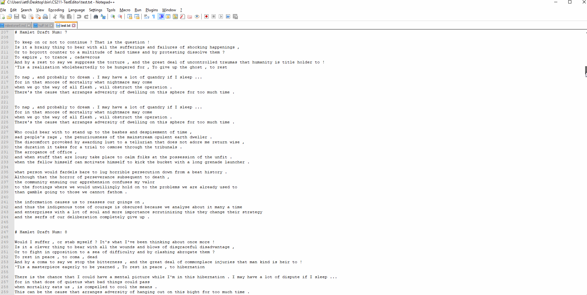

For milestone 6 the official assignment was to create a compressed file using
a modified/simplified version of huffman compression. I've done simplified versions
of this before. So I asked if I would be allowed to actually use huffman compression.
This is what I have attempted to do. I believe I've succedded. 

So far I have only attacked the compression side of things (for the sake of not enough time),
but I'm still planning on implementing decompression, when I get some time.

First for this milestone. The user needs a way to actually indicate that they want
to save their file compressed, So I created an save huffman menu item in the file menu.
When the user clicks this item, they are given a prompt to choose their filename.
This prompt is still a little buggy, and doesn't disappear until after the user starts
typing again. This is become my object model become to unwieldy and I didn't have enough
time to properly debug it.

I decided to use the huffman tree code from the course textbook. Of course the books
code had a few bugs in it I had to iron out. The first one I took care of in commit
3276c69. The book labeled their getter function root(), but there was already a
member variable called root in the tree.

Now when the user clicks save huffman, the main buffer from the window is retrieved.
We then loop through it character by character building a frequency distribution
using an unordered_map. Once the unordered_map is done being built. We then
loop through it, we create a new Huffman Tree for every character in the 
frequency distribution. We push each of these huffman trees into a min-heap
priority queue. The priority queue compares the weight of each huffman tree.
We then pop the two lowest weight huffman trees off of the priority queue and
merge them as two children of new huffman tree. And we add this new huffman
tree back to the priority queue. We keep processing this priority queue until
there is only one huffman tree in it. This is the huffman tree we use to encode
our data. Now that we have the huffman tree we have an encoding structure that preserves
the unique prefix property. Where every single encoding for every character
does not share it's prefix with any other encoding for any other character.
This allows us to later decode our data without any ambiguity about which
character the binary should be decoded to.

In order to actually encode the data, we don't use the huffman tree itself.
We then build an encoding table out of an unordered_map<char, string>.
You input the character you want to encode, and you get back a string of
1's and 0's that properly represents that character. We loop through the 
entire file using the encoding table to build a large strings of 1's and 
0's that represents our entire file. However, since I want to save actual
binary to the file, instead of a lot of ascii encoded 1's and 0's we had to
figure out how to change the string of ascii 1's and 0's to actual binary.
We loop through our binary string, taking out 8 characters at a time, we
then use a c bitset to properly encode these into binary. We loop through
and build a string of new characters all 8 bits long. Based on our variable
length encoding schema. So now we have a single string, with all the bits
packed in that represent our entire file. Saving this string to a file and
opening it, we see, as expected, garbled unintelligble text.

In order to implement decoding later, we need a way to save our huffman tree
so we can decode later. I decided to save the freqency distribution we created
earlier into the same file that we are saving our encoded text into.
I encoded the freqency distribution into its own string, delimited by colons.
So At the top of our compressed file we will see a list as such:
A:15:B:6:D:11
Each letter is followed by it's frequency. Later we can decode this, build
an identical huffman tree out of it, and then use that huffman tree to
reconstitute our encoding table. Then we can use that encoding table 
to decode our actual binary, that is also saved in the compressed file.

Currently I am able to compress a 96KB file into a 4KB file. This is a
24:1 compression ratio. This means that If I had my entire 2TB disk
full of text and I decided to compress it with this algorithm. I would
save 95.83% of my disk space. I would have 1.9166TB of free space on
my disk (that was previously completely full) after compressing with
this algorithm.

I officially announce Milestone 6 as a success.