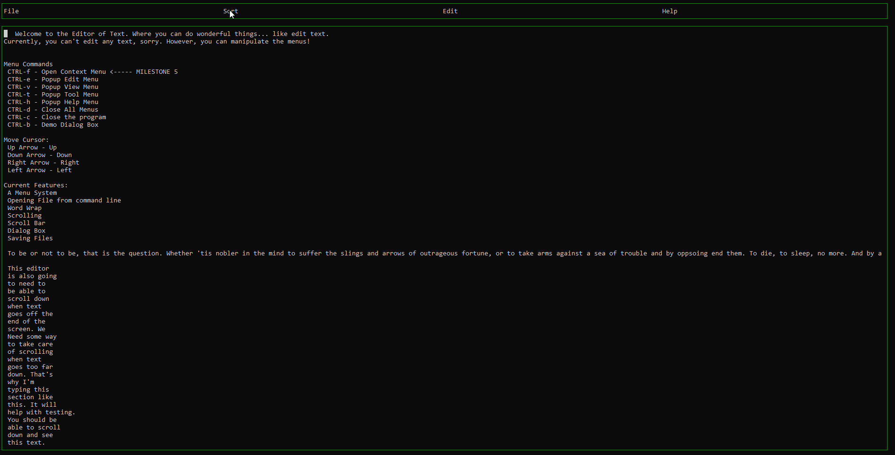

For Milestone 7 we had the choice to actually help another project or to do sorting algorithms
in our text editor. I decided not to contribute to another project, as I have done this before
and as I don't have a lot of time to learn someone elses code base at the end of the semester.

So I decided to take the sorting route. At first I was planning on implementing the Animation 
of the sorting algorithms by having my individual words work as movable labels. I created a 
new sorting window that was supposed to animate each individual moving label. I found a good
vector2 class online that would allow me to use vector math in the animation of these labels.
This way I could give each label a vector and a position. Everything under the hood worked
correctly. However I couldn't properly animate as I have a bug in my rendering code. I designed
my object oriented wrappers around curses before I fully understood how curses rendering works.
As a consequence my rendering code is janky itself. The animations don't smoothly animate as planned.

So then I skipped the idea of doing the animations for a bonus. I already have a pretty good 
grade, and this animation thing is taking a lot longer than it should seeing as how I've animated
a good deal of things before. So instead I decided to implement the sorting in my text editor.

This was pretty easy, first I had to create a menu option to allow the user to sort his data.
Then I had to create the sorting algorithms. I followed along pretty closely with what was
done in class. After I had the sorting algorithms in place. I had to Extract data from the
_buffer in the form of a vector of strings, where each individual word is in a different
element of the vector. Then I pass this vector to the sorting algorithm and have it sorted.
Then I immediately pass the vector back to my window, which automatically prints the entire
thing out, one word on each line. 

I used QuickSort, MergeSort, Insertion Sort and Selection Sort.